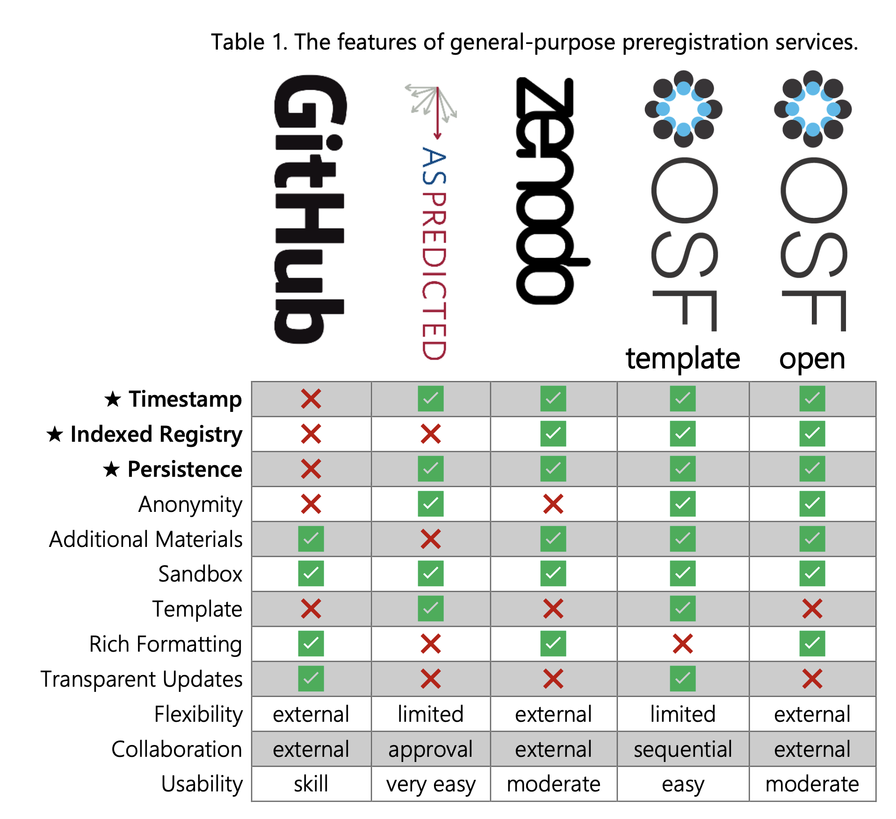

# (APPENDIX) Appendices {-} 

# References {-}

<div id="refs"></div>


# Glossary

This section will contain a glossary of relevant open science terminology. See also [A community-sourced glossary of open scholarship terms](https://doi.org/10.1038/s41562-021-01269-4){target="_blank"} [@parsons2022community].

```{r, echo = FALSE, eval = FALSE}
glossary_table(link = FALSE)
```


# Licenses

Shared code, data, and materials (including manuscript figures) should have an explicit license, such as CC-BY. This makes reuse straightforward. 

Authors may wish to contact their research office to discuss appropriate licenses for their situation, as whether research outputs should be licensed to the authors or their place of employment can differ between countries. 

While there is some ambiguity, many recommend against sharing research outputs using a CC-BY-NC licence, which prohibits commercial reuse, including in journal articles, or CC-BY-ND, which prohibits derivative use, such as meta-analyses or replications. 

* [Choosing between licenses](http://blog.psyarxiv.com/2018/05/14/licensing-work-psyarxiv/)
* [Creative Commons Licenses](https://creativecommons.org)
* [Open-source licenses](https://opensource.org/licenses) for code
* [CC BY: what does it mean for scholarly articles?](https://openaccess.ox.ac.uk/2013/06/13/cc-by-what-does-it-mean-for-scholarly-articles-3/)
* [Licenses for data sharing](https://www.ucl.ac.uk/library/research-support/research-data-management/licenses-data-sharing-creative-commons)


# Repositories

See the [Registry of Research Data Repositories](https://www.re3data.org/) for detailed listings of data repositories by subject.

This list is under construction and will summarise important attributes of the data repositories that are most relevant to APA journals. These attributes will include maximum file/project size, limitations, and costs.

```{r, echo = FALSE}
library(dplyr)

repos <- tibble::tribble(
  ~name, ~link, ~doi, ~managed, ~versions, ~notes,
  "UK Data Service", "https://ukdataservice.ac.uk", F, T, NA, "",
  "Open Science Framework (OSF)", "https://osf.io", T, F, T, "",
  "Harvard Dataverse", "https://dataverse.harvard.edu/", T, T, NA, "",
  "Databrary", "https://nyu.databrary.org/", T, T, NA, "storing, streaming, and sharing video and audio recordings",
  "Figshare", "https://figshare.com/", T, F, T, "",
  "Zenodo", "https://zenodo.org/", T, F, T, "Links to GitHub for archiving code snapshots",
  "GitHub", "https://github.com", F, F, T, "Primarily for code",
  "Inter-university Consortium for Political and Social Research (ICPSR)", "https://www.icpsr.umich.edu/", T, T, T, "",
  "LDbase", "https://ldbase.org/", F, T, NA,  "NIH-funded, educational and developmental sciences ",
  "Research Data Center(RDC) at ZPID", "https://rdc-psychology.org/", NA, T, NA, "paid curation service"
) %>%
  mutate(service = glue::glue("<a href='{link}'>{name}</a>")) %>%
  select(service, doi, managed, versions, notes)

DT::datatable(repos, 
              escape = FALSE, 
              rownames = FALSE,
              filter = "top",
              options = list(dom="ltipr"))
```


## Registries

[Comparison of Preregistration Platforms](https://osf.io/preprints/metaarxiv/zry2u) [@haroz_2022]

```{r, echo = FALSE, fig.cap="Figure reproduced from Haroz, 2022"}

```


* [As Predicted](https://aspredicted.org/)
* [ClinicalTrials.gov](https://clinicaltrials.gov/)
* [Open Science Framework (OSF)](https://osf.io)
* [The American Economic Association's registry for randomized controlled trials](https://www.socialscienceregistry.org/)
* [EGAP Design Registration](https://egap.org/registry-0/)
* [Registry for International Development Impact Evaluations](http://ridie.3ieimpact.org/)
* [OSF Registered Report protocol registration](https://osf.io/rr/)

